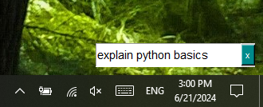
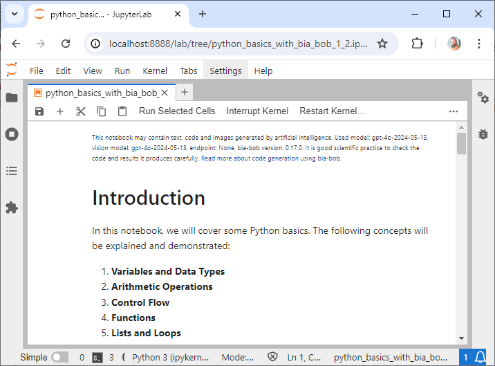

# Robbot

Robbot is a small search field that opens on the bottom right of your screen:



After entering something and hitting ENTER, it will generate a Python Jupyter notebook with the response.



You can make use of it by installing tkinter and bia_bob. It is recommended to install them in a conda environment.

You can then create a new shortcut in this folder (replace USERNAME with your username):

´´´
C:\Users\USERNAME\AppData\Roaming\Microsoft\Windows\Start Menu\Programs
´´´

The shortcut should point to the following command (replace ENVIRONMENT with the name of your conda environment)

```
C:\Users\haase\mambaforge\envs\ENVIRONMENT\python.exe robbot.py
```

And the working directory should be the folder where robbot.py is located.

